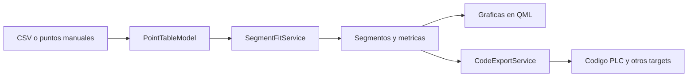

# Segmented Linear Fit Encoder

Aplicacion desktop en Qt 6 + C++ para convertir una curva medida en una aproximacion lineal por tramos.

La app actual se presenta como `Piecewise Linear Fit Studio` y permite:

- cargar puntos desde CSV
- generar rangos manuales con `min / max / intervals`
- editar valores `X` y `Y` desde la tabla
- analizar segmentos lineales consecutivos
- revisar residuos y tolerancias con graficas
- exportar codigo para `PLC`, `Python`, `C++`, `JavaScript`, `Java` y `C#`

## Flujo General



## Documentacion

La documentacion completa vive en [`docs/`](./docs/README.md):

- [`docs/README.md`](./docs/README.md): indice general
- [`docs/architecture.md`](./docs/architecture.md): capas, clases y flujo entre QML y C++
- [`docs/algorithm.md`](./docs/algorithm.md): algoritmo de segmentacion, formulas y criterios
- [`docs/usage.md`](./docs/usage.md): guia funcional de la interfaz y la exportacion
- [`docs/notebooks/segmented-linear-fit.md`](./docs/notebooks/segmented-linear-fit.md): notebook legado y relacion con la app actual

## Uso Rapido

1. Abrir `CMakeLists.txt` en Qt Creator.
2. Cargar un CSV o generar puntos manualmente.
3. Completar los valores `Y` faltantes si hace falta.
4. Ejecutar `Analyze`.
5. Revisar graficas, segmentos y codigo exportado en `Results`.

## Build En Windows Con Qt

```powershell
C:\Qt\6.10.2\llvm-mingw_64\bin\qt-cmake.bat -S . -B build-cpp-qt -G Ninja -DCMAKE_MAKE_PROGRAM=C:/Qt/Tools/Ninja/ninja.exe -DCMAKE_CXX_COMPILER=C:/Qt/Tools/llvm-mingw1706_64/bin/clang++.exe
C:\Qt\Tools\Ninja\ninja.exe -C build-cpp-qt
C:\Qt\6.10.2\llvm-mingw_64\bin\windeployqt.exe --qmldir qml build-cpp-qt\piecewise-linear-fit.exe
```

Ejecutable esperado:

- `build-cpp-qt/piecewise-linear-fit.exe`

## Estructura Del Repo

- `src/`: backend en C++ (`AppController`, modelo de puntos, analisis y exportacion)
- `qml/`: interfaz Qt Quick (`Main.qml`, paginas y componentes)
- `files/`: notebook original y CSVs de ejemplo
- `docs/`: documentacion tecnica y funcional

## Datos De Ejemplo

El repo incluye archivos de prueba en `files/`:

- `files/data1_length.csv`
- `files/data2_length.csv`
- `files/segmented_linear_fit.ipynb`

## Nota

La implementacion principal hoy es la app en C++/QML. El notebook original se mantiene como referencia historica y fuente del enfoque de segmentacion.
