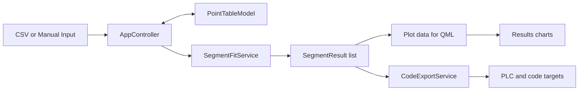
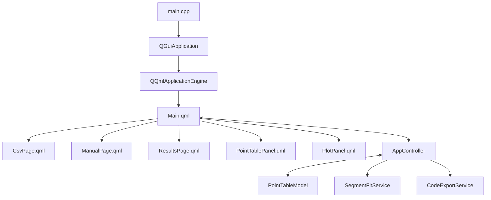
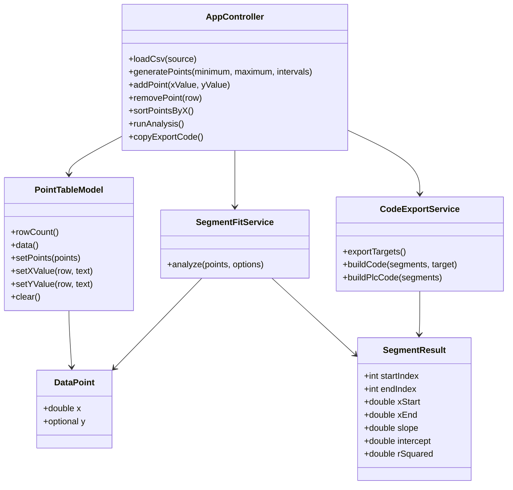
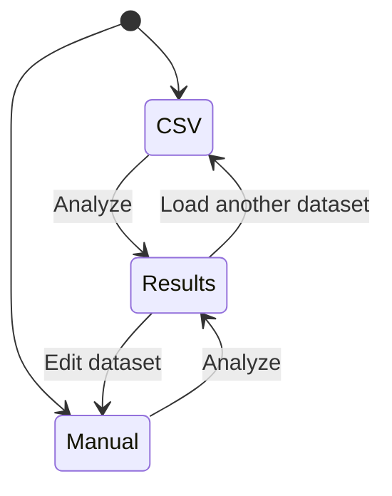
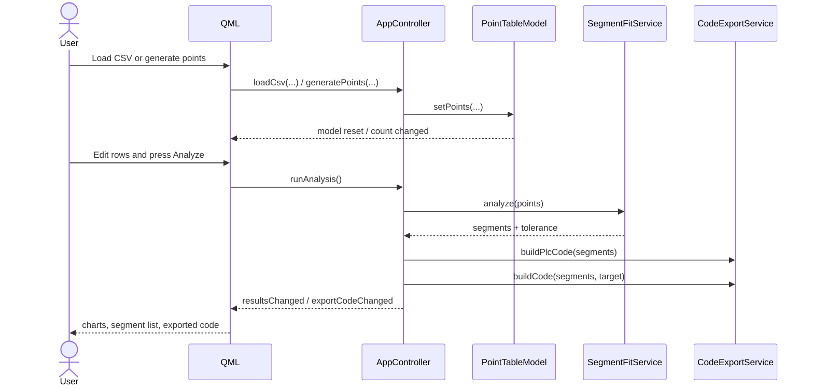
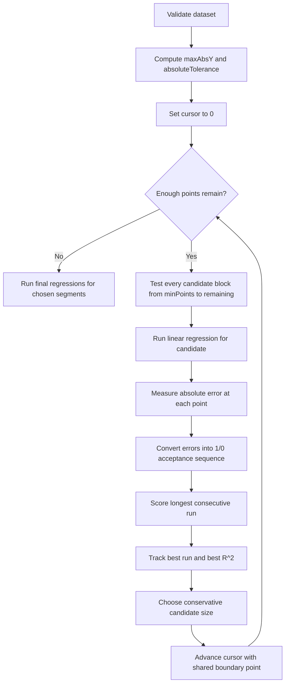
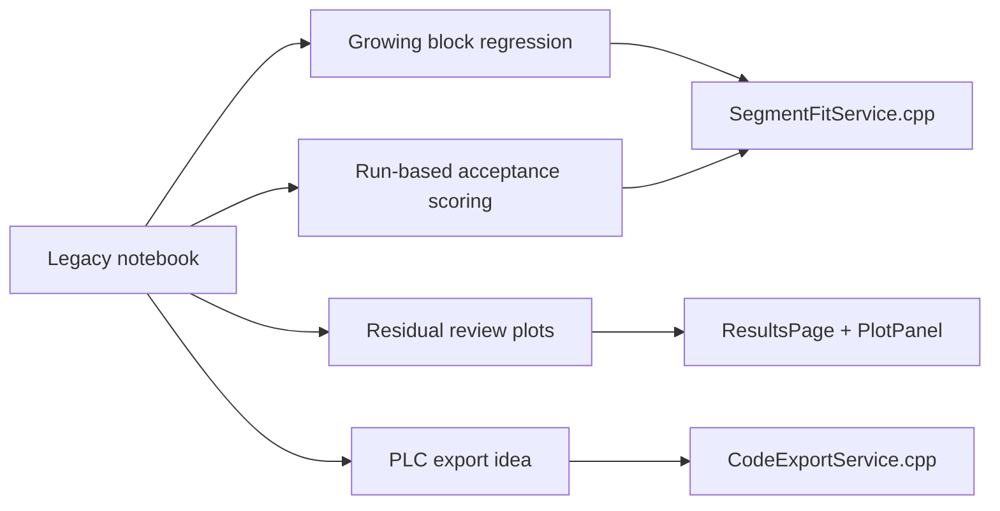

# Project Documentation

This document explains the current Qt/C++ application end to end: architecture, data flow, segmentation logic, charts, export flow, and the relationship with the legacy notebook.

## 1. What This Project Is

`Piecewise Linear Fit Studio` is a desktop application built with Qt 6, C++, and QML. Its goal is to take measured data and approximate it with multiple linear segments instead of a single global line.

The app supports:

- CSV import
- manual point generation
- direct point editing
- piecewise linear segmentation
- residual review charts
- code export for PLC, Python, C++, JavaScript, Java, and C#

## 2. High-Level System View



## 3. Runtime Architecture



## 4. Main Components

| Component | Responsibility |
| --- | --- |
| `src/main.cpp` | Starts the app, creates the QML engine, and exposes `appController` to QML. |
| `src/AppController.*` | Main bridge between UI and backend state. Handles import, point generation, editing, analysis, chart data preparation, and export output. |
| `src/PointTableModel.*` | `QAbstractListModel` used by the editable points table. |
| `src/SegmentFitService.*` | Runs the piecewise linear segmentation algorithm. |
| `src/CodeExportService.*` | Converts computed segments into target language code. |
| `src/PointTypes.h` | Shared data types: `DataPoint` and `SegmentResult`. |
| `qml/Main.qml` | Main window, layout shell, page navigation, status area. |
| `qml/pages/CsvPage.qml` | CSV import flow. |
| `qml/pages/ManualPage.qml` | Range generation and custom point editing flow. |
| `qml/pages/ResultsPage.qml` | Summary, charts, segment cards, and export panel. |
| `qml/components/PointTablePanel.qml` | Editable points table UI. |
| `qml/components/PlotPanel.qml` | Custom `Canvas`-based chart renderer. |

## 5. Core Data Structures



### `DataPoint`

- `x` is always required.
- `y` is optional while the user is still filling the dataset manually.

### `SegmentResult`

Each computed segment stores:

- the original start and end indices
- `xStart` and `xEnd`
- slope
- intercept
- `R^2`

That is enough for:

- segment cards in the UI
- fitted line rendering
- code export generation

## 6. User Flow



The application has three pages:

- `CSV Import`
- `Manual Input`
- `Results`

### CSV Import

This path is used when the dataset already exists in a file.

The loader:

- accepts local file URLs and normal paths
- auto-detects `,`, `;`, or tab delimiters
- supports quoted fields
- skips the first row if it looks like a non-numeric header
- reads only the first two columns as `X` and `Y`
- accepts decimal values written with `.` or `,`

Recommended CSV shape:

```csv
Length_m,Value_Analog
0,0
100,3212.5
200,6394
```

### Manual Input

This page has two modes.

#### Range mode

The user provides:

- minimum
- maximum
- interval count

The app creates `intervals + 1` evenly spaced `X` values and leaves `Y` empty.

#### Custom points mode

The user can:

- create endpoint rows
- add rows manually
- edit both `X` and `Y`
- delete rows
- sort rows by `X`

### Points Table

The points table is backed by `PointTableModel`.

It allows:

- direct editing of `Y`
- optional editing of `X`
- visual detection of missing `Y` values

The analysis is blocked until every point has a `Y` value.

## 7. Controller-Centered Data Flow

`AppController` is the state hub of the app.

It exposes:

- dataset state
- status text
- analysis results
- chart series
- export targets and generated code

This keeps the split clean:

- QML handles layout and interaction
- C++ handles parsing, analysis, and output generation

## 8. Interaction Sequence



## 9. Segmentation Algorithm

The algorithm lives in `SegmentFitService::analyze()`.

Its purpose is to split one ordered curve into consecutive linear segments.

### Inputs

- a `QVector<DataPoint>`
- `minimumPointsPerSegment`, default `4`
- `fitTolerancePercent`, default `0.01`

### Absolute Tolerance

The segment fit tolerance is derived from the overall `Y` scale:

```text
absoluteTolerance = fitTolerancePercent * maxAbsY / 100
```

where `maxAbsY` is the maximum absolute `Y` value in the dataset.

### Algorithm Flow



### Candidate Regression

For each candidate block, the service computes:

```text
slope = (n * sumXY - sumX * sumY) / (n * sumXX - sumX * sumX)
intercept = (sumY - slope * sumX) / n
```

Then it computes:

```text
R^2 = 1 - SSres / SStot
```

If the regression denominator is near zero, the candidate is rejected.

### Acceptance Sequence

For every point in the candidate block:

```text
error = abs(predicted - actual)
```

If the error is within tolerance, the point becomes `1`, otherwise `0`.

Example:

```text
[1, 1, 1, 0, 0, 1]
```

The service scores the candidate using the longest consecutive run of `1`s, not the total number of accepted points.

### Segment Size Decision

The service identifies:

- the candidate with the best acceptance run
- the candidate with the best `R^2`

Then it chooses:

```text
chosenCount = min(bestCountByRun, bestCountByR2)
```

This is a conservative choice: it keeps both criteria involved and avoids blindly taking the largest or most optimistic candidate.

### Shared Boundary Points

After a segment is chosen, the cursor advances by:

```text
chosenCount - 1
```

That means the last point of one segment becomes the first point of the next segment.

Example:

- segment 1: indices `0..4`
- segment 2: indices `4..8`

This preserves continuity between neighboring segments.

### Edge Handling

The service also avoids degenerate segments:

- if one point would be left alone at the end, it gets absorbed
- if the last segment ends up with fewer than 2 points and a previous segment exists, it gets merged back

### Final Regression Pass

After the split points are decided, the service recomputes regression on each final segment. Those final values are what the UI and export system use.

## 10. Charts And Review Metrics

After analysis, `AppController` derives multiple chart series.

### Chart Set

| Chart | Meaning |
| --- | --- |
| `Measured Data + Piecewise Fit` | segmented points plus final fitted lines |
| `Measured Data Only` | segmented points only |
| `Piecewise Lines Only` | fitted segment lines only |
| `Residual vs Global Line` | residuals against a single global reference line |
| `Segment Residual Error` | residuals against each segment, plus tolerance band and outlier markers |

### Global Residual Reference

The global residual chart does not use a full regression over all points.

Instead, it builds one reference line using:

- the second point and the last point when possible
- otherwise the first and the last point

This mirrors the style of the original notebook workflow.

### Segment Review Thresholds

Two review thresholds are used in the residual chart logic:

- visual band: `0.2 * maxAbsY / 100`
- outlier marker threshold: relative error greater than `0.1%` of `maxAbsY`

These values are currently fixed in code and not configurable in the UI.

## 11. Code Export

`CodeExportService` supports:

- `PLC`
- `Python`
- `C++`
- `JavaScript`
- `Java`
- `C#`

### Export Pattern

All targets follow the same basic idea:

- compare the input against segment bounds
- apply the segment equation `m * x + b`
- fall back to `0.0` outside the covered lower range

Conceptual PLC example:

```text
IF IN_VALUE >= x0 AND IN_VALUE < x1 THEN
    OUT_LONG := m0 * IN_VALUE + b0;
ELSIF IN_VALUE >= x1 AND IN_VALUE < x2 THEN
    OUT_LONG := m1 * IN_VALUE + b1;
ELSIF IN_VALUE >= x2 THEN
    OUT_LONG := m2 * IN_VALUE + b2;
ELSE
    OUT_LONG := 0.0;
END_IF
```

Important behavior:

- the last segment uses only a lower bound
- values above the final segment range are extrapolated by that last segment
- values below the first lower bound fall back to `0.0`

## 12. Why `PlotPanel.qml` Is Custom

The project uses a custom `Canvas` chart renderer instead of `QtCharts`.

That design gives the app direct control over:

- lines versus markers
- legend visibility
- tolerance bands
- reference lines
- per-point labels

The tradeoff is that more chart logic must be maintained manually.

## 13. State Invalidation Rules

Whenever the dataset changes, `AppController::invalidateResults()` clears:

- segment cards
- fitted series
- residual series
- PLC text
- exported code
- summary text

This prevents stale results from being shown after the dataset is edited.

## 14. Legacy Notebook Relationship

The original notebook is still stored in:

- `files/segmented_linear_fit.ipynb`

The current app is not a literal one-to-one translation, but it clearly inherits the same core ideas.



What stayed the same:

- growing candidate blocks
- absolute-error acceptance logic
- `R^2` as a secondary fit signal
- final piecewise equations
- PLC-style output

What changed in the app:

- Excel-specific loading became CSV/manual input
- notebook cells became reusable classes and methods
- plotting moved to QML `Canvas`
- export targets now include multiple languages
- UI state is managed consistently through `AppController`

## 15. Practical Assumptions And Limits

- The dataset should be ordered by `X`.
- The app does not auto-sort CSV files before analysis.
- Repeated or nearly repeated `X` values can make regressions invalid.
- Analysis options are not yet user-configurable from the UI.
- The segmentation is heuristic and incremental, not a global optimizer.

## 16. Repository Layout

```text
src/    C++ backend and services
qml/    QML pages and reusable UI components
files/  sample CSV files and legacy notebook
docs/   project documentation
```

## 17. Short Summary

This project is a Qt desktop tool that turns measured curves into piecewise linear equations. QML handles the interface, `AppController` coordinates the state, `SegmentFitService` computes the segments, `PlotPanel` visualizes the results, and `CodeExportService` turns those segments into runnable code.
